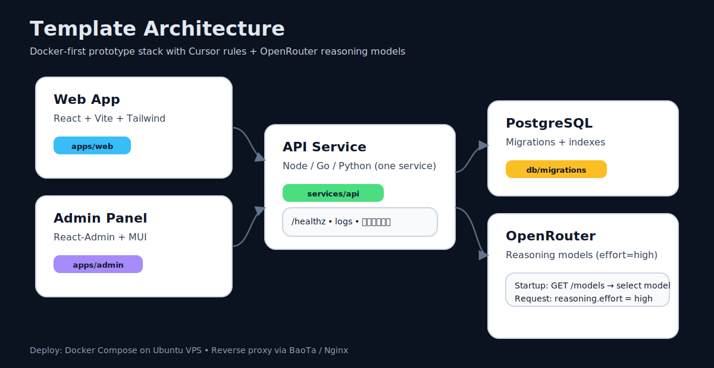
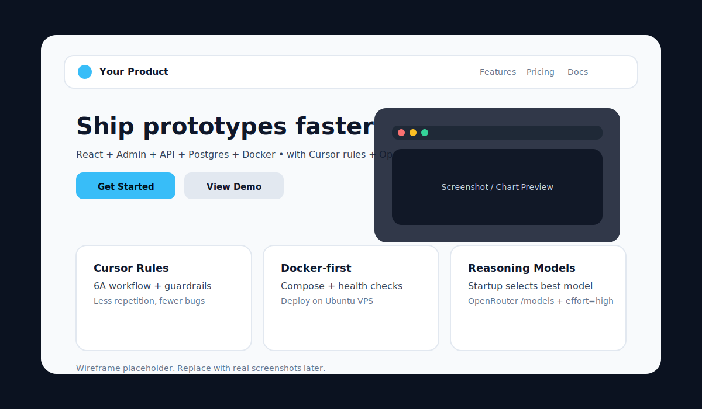

# project-starter

A **full-stack prototype template** designed for rapid iteration. One command brings up everything.

| Layer | Tech |
|-------|------|
| **Web** | React + Vite + TypeScript + TailwindCSS |
| **Admin** | React-Admin (MUI) |
| **API** | Node (Fastify) / Go (Gin) / Python (FastAPI) |
| **Database** | PostgreSQL |
| **Gateway** | Nginx |
| **Deploy** | Docker Compose |

> **Use this template**: Click the green "Use this template" button on GitHub to create your own repo.

---

## ✨ Features

- 🚀 **One command startup** - `docker compose up -d --build`
- 🔄 **Switchable backends** - Node, Go, or Python with compose overlays
- 🧠 **OpenRouter ready** - Reasoning mode with `effort: high`
- 🗄️ **PostgreSQL** - Migrations and seeds run automatically
- 🎨 **Modern UI** - Dark theme, status indicators, animations
- 📊 **React-Admin** - Pre-configured with users resource

---

## 🧭 Architecture



---

## 🚀 Quick Start

### 1. Clone & Configure

**Mac / Linux:**
```bash
git clone https://github.com/your-username/project-starter.git
cd project-starter
cp .env.example .env
# Edit .env and add your OPENROUTER_API_KEY
```

**Windows (PowerShell):**
```powershell
git clone https://github.com/your-username/project-starter.git
cd project-starter
Copy-Item .env.example .env
# Edit .env and add your OPENROUTER_API_KEY
```

### 2. Start Services

```bash
docker compose up -d --build
```

### 3. Access

| URL | Description |
|-----|-------------|
| http://localhost:8080/ | Web landing page |
| http://localhost:8080/admin/ | React-Admin panel |
| http://localhost:8080/api/healthz | API health check |
| http://localhost:8080/api/hello | Hello endpoint |

---

## 🔄 Switch Backend

The default backend is **Node.js (Fastify)**. Switch using compose overlays:

**Go (Gin):**
```bash
docker compose -f compose.yaml -f compose.go.yaml up -d --build
```

**Python (FastAPI):**
```bash
docker compose -f compose.yaml -f compose.py.yaml up -d --build
```

**Back to Node:**
```bash
docker compose up -d --build
```

---

## 🖥️ Landing Page Preview



---

## 📋 API Endpoints

All backends implement the same routes:

| Method | Path | Description |
|--------|------|-------------|
| GET | `/api/healthz` | Health check with DB status |
| GET | `/api/hello` | Returns `{ message, backend }` |
| GET | `/api/admin/users` | List users (React-Admin format) |
| GET | `/api/admin/users/:id` | Get single user |
| POST | `/api/ai/reason` | OpenRouter reasoning (Node/Python) |

### Example: Test Reasoning

```bash
curl -X POST http://localhost:8080/api/ai/reason \
  -H "Content-Type: application/json" \
  -d '{"prompt": "Explain step by step why 2+2=4"}'
```

---

## 📁 Project Structure

```
project-starter/
├── apps/
│   ├── web/                 # React landing page (Vite + Tailwind)
│   └── admin/               # React-Admin panel
├── services/
│   ├── api-node/            # Node.js Fastify (default)
│   ├── api-go/              # Go Gin alternative
│   └── api-py/              # Python FastAPI alternative
├── packages/
│   └── shared/ai/           # OpenRouter clients (TS + Python)
├── db/
│   ├── migrations/          # SQL migrations
│   ├── seed/                # Seed data
│   └── init.sql             # Master init script
├── infra/
│   └── nginx/               # Gateway config
├── scripts/                 # Utility scripts
├── docs/assets/             # SVG diagrams
├── .cursor/commands/        # Cursor AI commands
├── compose.yaml             # Main compose (Node backend)
├── compose.go.yaml          # Go backend override
├── compose.py.yaml          # Python backend override
├── .env.example             # Environment template
└── .cursorrules             # Cursor AI rules
```

---

## 🛠️ Common Commands

| Command | Description |
|---------|-------------|
| `docker compose up -d --build` | Start all services |
| `docker compose down` | Stop all services |
| `docker compose down -v` | Stop + delete volumes (reset DB) |
| `docker compose logs -f` | View all logs |
| `docker compose logs -f api` | View API logs only |
| `docker compose restart api` | Restart API service |
| `docker compose ps` | Check service status |

---

## 📝 Environment Variables

Copy `.env.example` to `.env` and configure:

| Variable | Required | Description |
|----------|----------|-------------|
| `OPENROUTER_API_KEY` | For AI features | Get from [openrouter.ai/keys](https://openrouter.ai/keys) |
| `POSTGRES_USER` | No (default: postgres) | Database user |
| `POSTGRES_PASSWORD` | No (default: postgres) | Database password |
| `POSTGRES_DB` | No (default: app) | Database name |
| `GATEWAY_PORT` | No (default: 8080) | Exposed port |

---

## 🏗️ Making This a GitHub Template

1. Go to your repo's Settings
2. Check "Template repository" under General
3. Users can now click "Use this template" to create their own copy

---

## ❓ FAQ

### Dotfiles not uploading via GitHub web UI?
GitHub's web file uploader hides files starting with `.` (like `.cursorrules`, `.env.example`). Use `git push` instead.

### Port 8080 is already in use?
Change `GATEWAY_PORT` in your `.env` file:
```
GATEWAY_PORT=3000
```

### Windows line ending issues?
Configure Git to use LF:
```bash
git config --global core.autocrlf input
```

### Database not initializing?
Migrations only run on first startup. To reset:
```bash
docker compose down -v
docker compose up -d --build
```

### React-Admin shows no users?
Check that the API is healthy:
```bash
curl http://localhost:8080/api/admin/users
```

---

## 🔧 Local Development (without Docker)

### Web
```bash
cd apps/web
npm install
npm run dev
```

### Admin
```bash
cd apps/admin
npm install
npm run dev
```

### API (Node)
```bash
cd services/api-node
npm install
npm run dev
```

You'll need a local PostgreSQL instance with the schema from `db/migrations/`.

---

## 📜 License

MIT - Use freely, customize, and ship fast!
